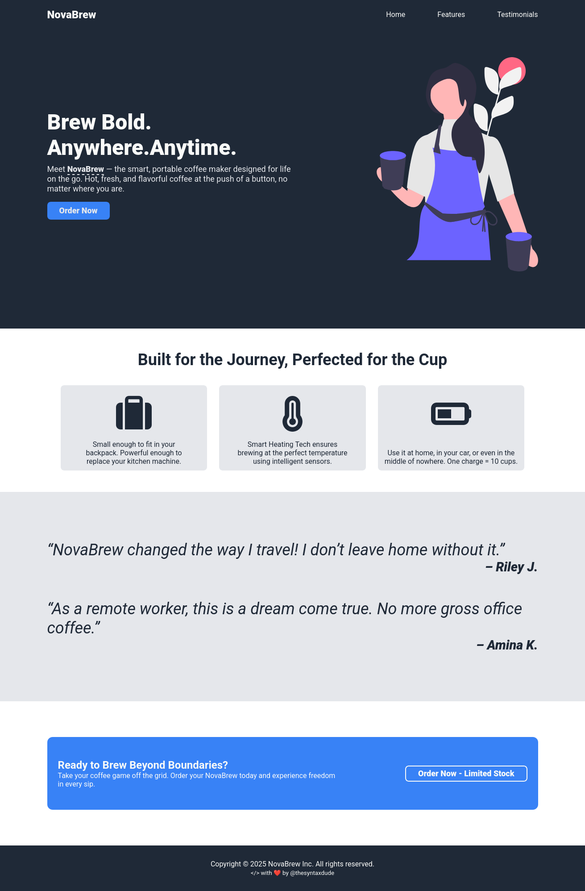

# Overview
This is a challenge from theOdinProject.

## The Challenge
Build a landing page based on a preview.

## Built With
- Desktop-First approach (very hectic by the way... I'm going to try and avoid this anytime I can, lol)
- CSS Custom Properties
- Responsive Design
- Pure HTML
- Vanilla CSS

## Lessons
- Mobile-first approach is faster and easier as compared to desktop-first approach.
- I need to learn JS quick so I can build one of those 'fancy' hamburger menus on my mobile and tablet versions.
- I've come a long way and should find a way to stop feeling like I'm not cut out for this.

##Got any suggestions?
Reach out to me:

- [linkedin]
- [X / Twitter]

  [linkedin]: <https://linkedin.com/in/princeakakpo>
  [X / Twitter]: <https://twitter.com/thesyntaxdude>
